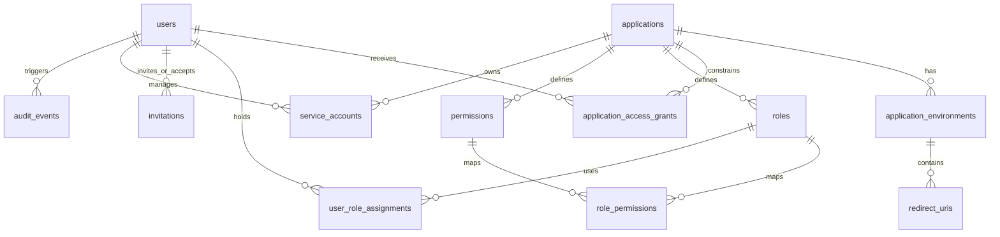

# Database Design

The database schema manages identities, permissions, clients, and audits. Production and integration environments must use PostgreSQL. SQLite fallback is intentionally unsupported.

## Schema Architecture

The database manages several functional sub-systems:

### Core Entities

#### Users (`users`)
Holds external federated identity subjects mapped against Keycloak attributes.
* **Stable Identifier**: A composite key of `(identity_issuer, identity_subject)` uniquely identifies users independent of changing email addresses.
* **Attributes**: `id` (UUID), `keycloak_user_id` (OIDC subject), `email` (normalized index), `status` (StrEnum: invited, active, suspended, disabled, deleted).

#### Applications (`applications`)
Represents the target services integrating with IITD IAM.
* **Attributes**: `id`, `key`, `name`, `status`, `authorization_mode` (authentication_only, application_access, direct_roles, product_managed).

#### Environments & Clients (`application_environments`, `redirect_uris`)
Enables env-level (development, staging, production) properties, OIDC Client settings, and OIDC redirect URIs.
* **Redirect constraints**: URI matches are exact. Wildcards (`*`) are disallowed via database check constraints (`ck_redirect_uri_no_wildcard`) to prevent OIDC redirection attacks.

#### RBAC (`roles`, `permissions`, `role_permissions`, `user_role_assignments`)
Provides fine-grained role mapping.
* **Scope**: Roles are either `platform`-wide or scoped strictly to an `application`.
* **Inheritance**: Roles map to permissions via the join table `role_permissions`.

#### Invitations (`invitations`)
Secures invitation tokens for enrolling users into applications with pre-allocated roles. Includes `token_hash` index to check validation without leaking cleartext tokens.

#### Auditing (`audit_events`)
A immutable timeline storing actor metadata, source IPs, action targets, and JSON diffs (`before_summary`, `after_summary`). Indexed heavily on `created_at`, `actor_user_id`, and `application_id`.
