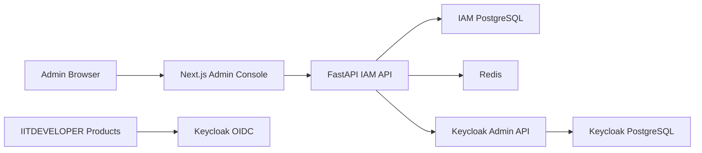

# High-Level Design

```mermaid
flowchart LR
  Admin["Admin Browser"] --> UI["Next.js Admin Console"]
  UI --> API["FastAPI IAM API"]
  API --> DB["IAM PostgreSQL"]
  API --> Redis["Redis"]
  API --> KC["Keycloak Admin API"]
  Products["IITDEVELOPER Products"] --> Auth["Keycloak OIDC"]
  KC --> KCDB["Keycloak PostgreSQL"]
```

Keycloak owns authentication, token issuance, MFA, sessions, password reset and federation. IAM owns administrative workflows and product-access metadata.

