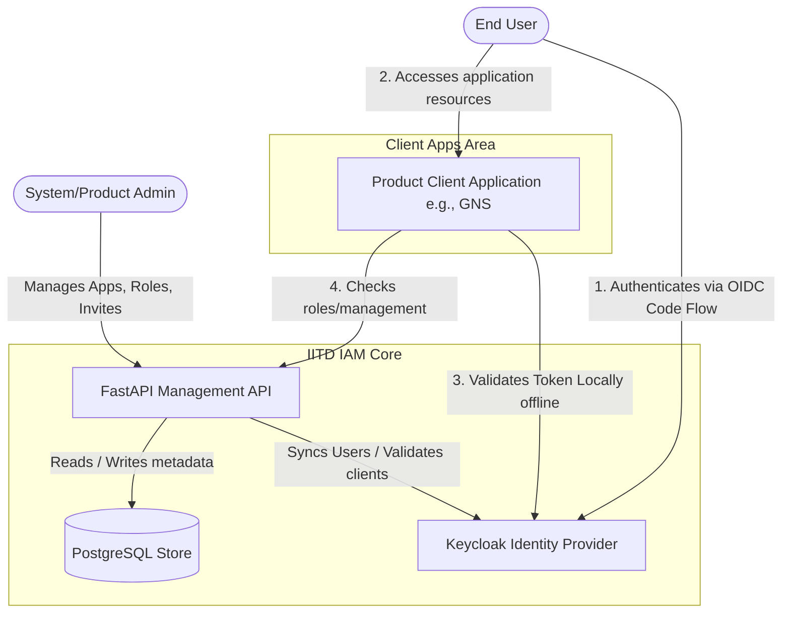

# System Context

IITD IAM sits between IITDEVELOPER administrators, product teams, product applications, and Keycloak. Client applications validate Keycloak-issued tokens locally and call IAM only for management, service account administration, or optional access-resolution APIs.

## Architecture Context Diagram

## System Responsibilities

| System | Primary Responsibilities |
| :--- | :--- |
| **Keycloak** | Authentication protocols (OIDC, SAML), user credentials, session cookies, MFA, token generation and cryptographic signing. |
| **IITD IAM API** | Application registrations, tenant/access grants, invitation lifecycle management, audit logs, service account secrets, and platform-wide/application-scoped RBAC definitions. |
| **Product Applications (e.g., GNS)** | Custom internal permissions, local session management, and business logic enforcement. |
